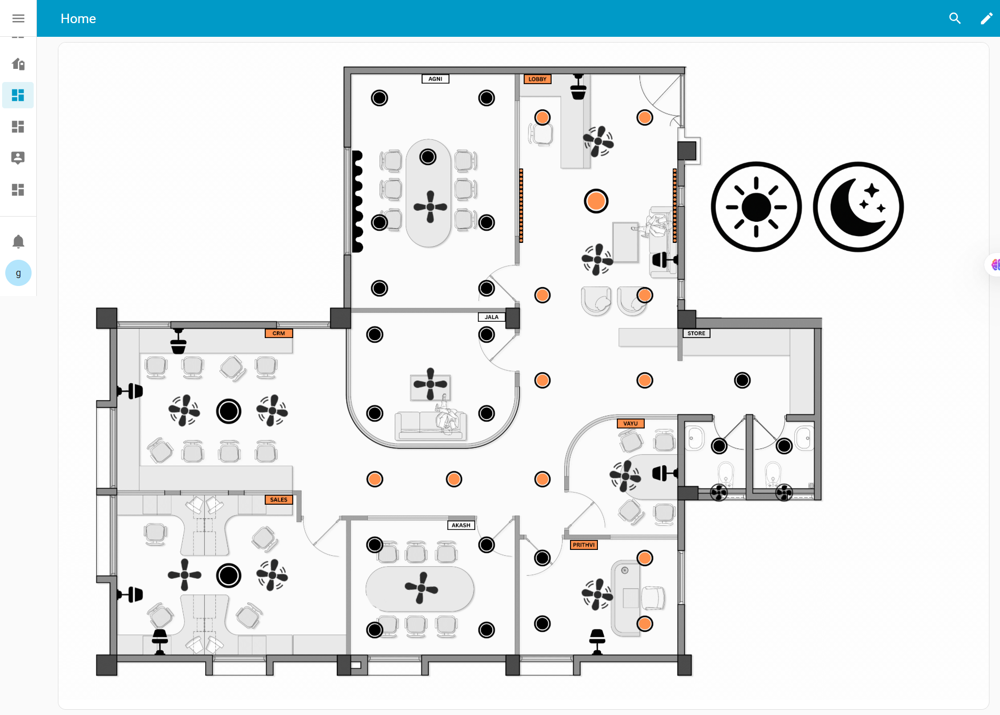

# Smart Home Dashboard — Project Report


## 🌟 Introduction
The vision was simple: controlling a smart home should feel as natural as tapping on a floor plan.  

To bring this idea to life, our team built a **custom smart home dashboard** using **Home Assistant** as the backbone, **Aqara devices** for control, and the **Matter protocol** for seamless connectivity.  

---

## 🏡 Features Implemented
- **Floor Plan Dashboard** – visual layout of the home for device interaction  
- **Room-Level Switching** – single-tap on/off for devices or entire rooms  
- **Curtain Controller** – percentage-based open/close flexibility  
- **Automated Scenes** – *Goodnight* to switch off everything, *Good Morning* to light up the lobby  

---

## ⚙️ Technology Stack
- **Home Assistant** (open-source home automation platform)  
- **Matter Protocol** (interoperability across devices)  
- **Aqara Switches** and sensors for device integration  
- **YAML Configuration** for dashboard customization  

---

## 📂 Proof of Implementation
YAML configuration files are available in the [`yaml-proof`](yaml-proof/floor_plan.yaml) folder.  

Example snippet:

```yaml
views:
  - title: Home
    sections:
      - type: grid
        cards:
          - type: picture-elements
            elements:
              - type: image
                entity: light.aqara_smart_wall_switch_z1_pro_3
                image: mr3fan
                state_image:
                  'on': /local/icons/fan_offf.png
                  'off': /local/icons/fan_off.png
                tap_action:
                  action: toggle
.
.
```
---

## 📸 Dashboard


---

## 🎥 Videos
<div style="display: flex; gap: 10px; width: 100%;">

  <div style="flex: 1; text-align: center;">
    <p><b>Room-Level Switching</b></p>
    <video width="100%" controls>
      <source src="videos/room_video.mp4" type="video/mp4">
    </video>
    <p><a href="videos/room_video.mp4">▶️ Watch / Download</a></p>
  </div>

  <div style="flex: 1; text-align: center;">
    <p><b>Curtain Automation</b></p>
    <video width="100%" controls>
      <source src="videos/curtain_video.mp4" type="video/mp4">
    </video>
    <p><a href="videos/curtain_video.mp4">▶️ Watch / Download</a></p>
  </div>

  <div style="flex: 1; text-align: center;">
    <p><b>Goodnight & Good Morning Scenes</b></p>
    <video width="100%" controls>
      <source src="videos/gn&gm_video.mp4" type="video/mp4">
    </video>
    <p><a href="videos/gn&gm_video.mp4">▶️ Watch / Download</a></p>
  </div>

</div>

---

## 👥 Team

This project was built by: **Abhilash**, **Amogh**, **Chaitra** and **Hansikha Venkatesh**

---

## 🔮 Future Scope

- Multi-floor dashboard integration
- Voice assistant compatibility (Alexa, Google Home, Siri)
- Energy monitoring and analytics dashboard
- Expanded automation scenes (e.g., Work Mode, Movie Night)
  

---

## 📜 License

This project is licensed under the [MIT License](LICENSE).
